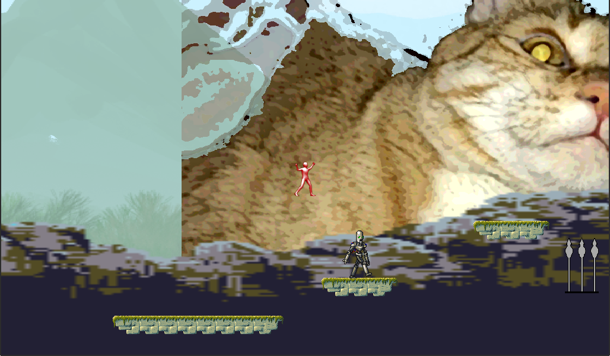

## HARDCORE!!
# The game ever made

https://kralinc.github.io/pages/hardcore2/index.html

This is a sequel/spiritual successor to my 2015 clickteam fusion game *HardCore!* (Note there's only one exclamation point and it's not in all caps.)

*HARDCORE!!* is a 2d platformer with 3 levels. It comes with 2 gamemodes: Practice and *HARDCORE!!*. 

In Practice mode you are able to try each level as many times as it takes to get to the end. When you die you are sent back to the beginning of the level.

In *HARDCORE!!* mode if you die anywhere, you are sent back to the beginning of the first level. This is the only way to get the true ending.

In both of these gamemodes you die in a single hit from anything.

# Controls

The game can be played with a keyboard or a controller. These both contain 2 different control schemes that can be switched between in the "controls" menu. The player has the following actions in game:

* Move left
* Move right
* Jump
* Walk

"Walk" makes the player move slower. Also note that your jump height will be higher the faster you run.

# How to play

* You may clone the github repo and run the game in the godot editor. It should not require any other setup to work.
* [The game is available online.](https://kralinc.github.io/pages/hardcore2/index.html) Due to the limitations of Godot's html5 export, the audio is desynched and may run worse than the native version.
* A windows/mac/linux build of the game will be up on (cactusdan.itch.io) soon.

# Programs and websites used in the creation of this game
* [Open Game Art](https://opengameart.org), for pretty much all of the art assets
* [Godot](https://godotengine.org/), the game engine
* [BeepBox](https://www.beepbox.co), the intro music
* [Audacity](https://www.audacityteam.org/), audio editing
* [GIMP](https://gimp.org), image editing
* [Kenney Creature Mixer](https://kenney.itch.io/creature-mixer), a couple of the enemies in level 2
* [Skuawk](https://skuawk.com), a couple of background images
* [Godot Shaders](https://godotshaders.com), shaders

# A near comprehensive list of every third party asset used in the game
* https://opengameart.org/content/platformer-animations
* https://opengameart.org/content/generic-platformer-tileset-16x16-background
* https://opengameart.org/content/fighting-robot-for-ultimate-smash-friends
* https://opengameart.org/content/spike-ball
* https://opengameart.org/content/spike-trap
* https://opengameart.org/content/arcane-magic-effect
* https://opengameart.org/content/backgrounds-for-2d-platformers
* https://opengameart.org/content/prototyping-2d-pixelart-tilesets
* https://kenney.nl/assets/platformer-art-pixel-redux
* https://opengameart.org/content/pink-monster-animation
* https://opengameart.org/content/sci-fi-platform-tiles
* https://opengameart.org/content/coin-animation
* https://opengameart.org/content/green-cristal
* https://opengameart.org/content/generic-gamepad-template
* https://opengameart.org/content/victory-1
* https://opengameart.org/content/victory
* https://commons.wikimedia.org/wiki/File:Qwerty.svg
* https://godotshaders.com/shader/2d-spinning-sphere/
* https://godotshaders.com/shader/squishy-scroll/
* https://godotshaders.com/shader/god-rays/

